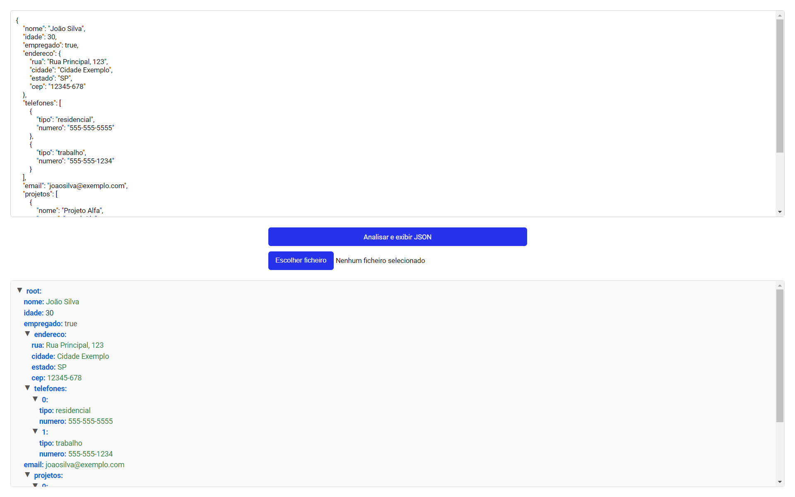

<div align="center">

Veja o aplicativo <a href="https://analisarjsonapp.netlify.app/">Aplicativo Analisador JSON</a>

<p>Este é um aplicativo simples para analisar e exibir dados JSON. Você pode inserir JSON manualmente em uma área de texto ou carregar um arquivo JSON para análise.</p>
</div>



👨🏼‍💻 <b>Tecnologias utilizadas:</b>

&nbsp;
&nbsp;
&nbsp;<hr>

🛠️ <b>Funcionalidades:</b>

- Inserção manual de JSON: Permite ao usuário inserir JSON manualmente em uma área de texto.
- Carregamento de arquivo JSON: Permite ao usuário carregar um arquivo JSON para análise.
- Visualização de JSON: Exibe o JSON formatado na tela.
- Animação de Botões: Os botões possuem uma animação infinita que altera a cor de fundo.<br><br>

🛠️ <b>Como utilizar:</b>

- Insira o JSON manualmente na área de texto ou carregue um arquivo JSON usando o botão de upload de arquivo.
- Clique no botão "Analisar e exibir JSON" para visualizar o JSON formatado.<br><br>

🧑🏻‍🔧 <b>Contribuição:</b>

- Faça um fork do projeto.
- Crie uma branch para a sua feature (git checkout -b feature/nova-feature).
- Commit suas alterações (git commit -m 'Adiciona nova feature').
- Envie para a branch (git push origin feature/nova-feature).
Abra um Pull Request.<br><br>

🛠️ <b>Executando o projeto:</b>

<p>Antes de começar, certifique-se de atender aos seguintes requisitos:</p>

[Git](https://git-scm.com/downloads "Download Git") deve ser instalado em seu sistema operacional.

Para executar o <b>projeto</b> localmente, execute este comando em seu git bash:

<b>Linux e macOS:</b>

```bash
git clone https://github.com/daniel-portela/app-analisador-json.git
```

<b>Windows:</b>

```bash
git clone https://github.com/daniel-portela/app-analisador-json.git
```
Depois de clonar o repositório, acesse o projeto com o seguinte comando:

```bash
cd app-analisador-json
```

```bash
Você pode abri-lo no VS Code digitando "code ."
```

⚙️ <b>Manutenção do código:</b>

Compromisso com a melhoria contínua do projeto, incluindo atualizações regulares de conteúdo e refinamento do design conforme necessário.<br><br>

🔒 Licença

É concedida permissão, gratuitamente, a qualquer pessoa que obtenha uma cópia deste software e arquivos de documentação associados (o "Software"), para lidar no Software sem restrições, incluindo, sem limitação, os direitos usar, copiar, modificar, mesclar, publicar, distribuir, sublicenciar e/ou vender cópias do Software e permitir que as pessoas a quem o Software é capacitado para fazê-lo, sujeito às seguintes condições: [leia mais](LICENSE)

✉️ <b>Contato:</b>

Se você tiver alguma dúvida, sugestão ou interesse em colaborar, não hesite em me contatar.

Email: <a href="mailto:danielportela.ti@gmail.com">danielportela.ti@gmail.com</a> 

